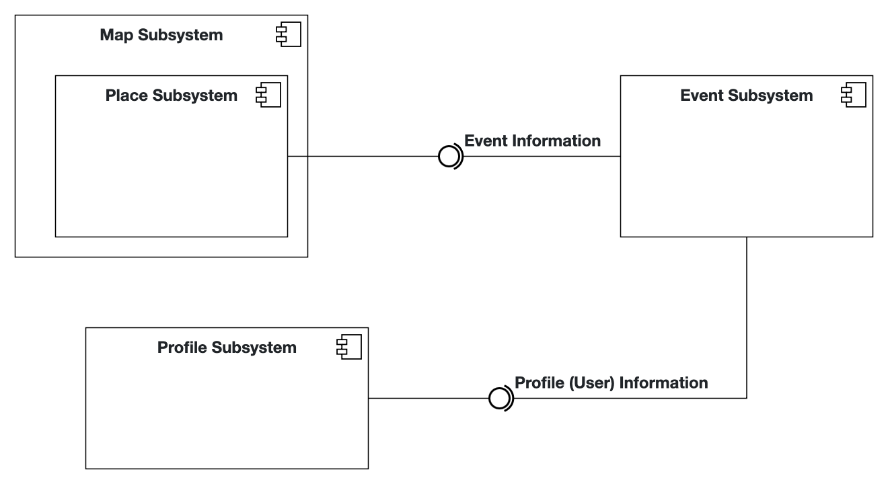

# Intro Course Project App of Mikhail Khinevich for the iPraktikum

To pass the intro course, you need to create your own unique iOS app (based on SwiftUI).

There are no requirements regarding the functions of your app, so you can get creative.
However, we provide you with Non-Functional Requirements (NFR) that your app needs to fulfill.

After each day of learning new Swift and SwiftUI concepts, these NFRs may change, or new NFRs get added.

## Submission procedure

You get a **personal repository** on Gitlab to work on your app.

Once you implemented a new feature into your app, you need to create a Merge Request (MR - Sometimes we will also reference these as "Pull Requests"(PR)) to merge your changes from the feature branch into your main branch.

Your tutor will review your changes and either request changes or approves the MR.

If your MR got approved, you also need to merge it!

### Deadline: **17.10.2023 23:59**

Until the deadline all of your PRs **need to be merged** and your final app **needs to fulfill** all of the requested NFRs!

---

## Problem Statement (max. 500 words)

As a student/any person, it might be difficult to find right place to chill and spent some free time. 
Using this application, you could solve the problem of finding a community to spend time in cultural places.
An application for finding a group of people with similar interests for going to bars or any other establishments.
The user could publish information about himself to make it easier for people or one person to find the company. 
He would have the opportunity to create an event, as well as opportunity to join an existing one by sending a request. 
This request would include information about that person and, if it would be approved, would create a chat room to exchange information.

## Requirements
User ...
1) ... should be able to login with his GitHub profile username, where he shares information about himself: Name, Surname, Age, Short Bio.
2) ... could create an event by specifying the time and place of visit, as well as giving short description.
3) ... could open 3D-Location Overview 
3) ... would have the opportunity to submit a request to join an existing event, which he will find on the map (not yet implemented)
4) ... could navigate to entered location by switching to apple maps on request.

## Analysis

## System Design

TODO ADD Diagram

## Product Backlog
| BFF # | Info                                                                              |
| ----- | --------------------------------------------------------------------------------- |
| BFF 0 | Profile UI, connection to GitHub via Open API                                     |
| BFF 1 | Implement internal Apple Map to the app                                           |
| BFF 2 | Pop-Up (sheet) with location description, which was searched in map searching bar |
| BFF 3 | Enable 3D-View around                                                             |
| BFF 4 | Add Event                                                                         |
| BFF 5 | Open in Maps function, with more precise location information                     |

